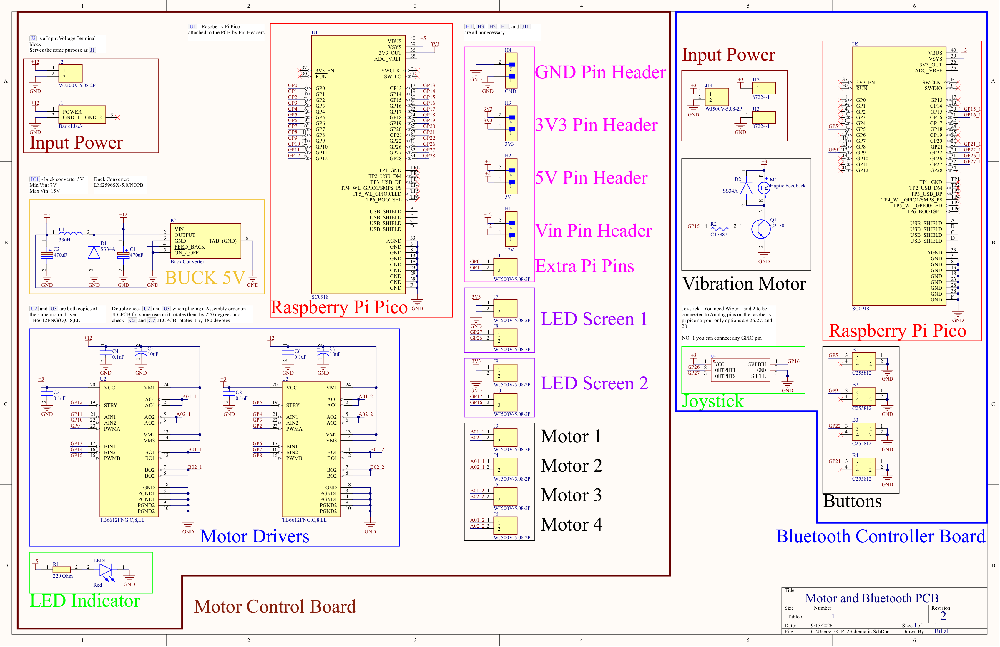

# Motor and Bluetooth Controller PCB

Motor control and handheld controller hardware developed for an educational robot at KiP Robotics. Both boards were combined into a single 2-in-1 PCB so they could be fabricated together and snapped apart after manufacturing. This results in a lower cost to make it more accessible to students.

## PCB

  

## Schematic

  

## Overview

This design combines two separate PCBs: a motor control board and a handheld controller board.

The motor control board handles power regulation and drives four motors, while the controller board provides the user interface through a joystick, buttons, and haptic feedback.

### Motor Control Board

- Raspberry Pi Pico based control.
- Two motor driver ICs for controlling up to four motors.
- 5 V buck converter for onboard power regulation.
- Connections for four motors.
- Connections for two LED screens.
- Additional power and GPIO headers for expansion.

### Bluetooth Controller Board

- Raspberry Pi Pico based controller.
- Joystick input for robot control.
- Four user input buttons.
- Vibration motor for haptic feedback.
- Interfaces with the motor control system.

## Cost Focused Design

The motor control board and Bluetooth controller board were designed together as a single breakaway PCB. The two boards are connected during fabrication and can be snapped apart after manufacturing.

## KiP Robotics

This PCB was developed as part of my work at KiP Robotics, where I led hardware design for a team developing an educational robot focused on making STEM learning more accessible.
